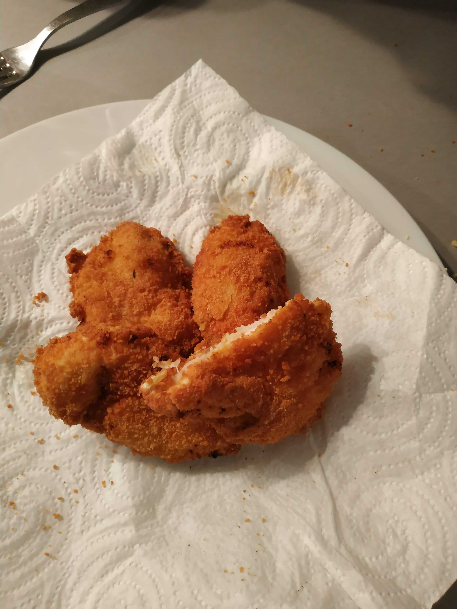

# Nuggets de poulet

## Remarques :
À préparer la veille.

## Ingrédients :
1. 1 gros blanc de poulet
2. Huile neutre à frire (arachide, spécial friture, tournesol, etc.).
3. 1 oeufs
4. Lait
5. Ail
6. Curry
7. Farine
8. Chapelure

## Préparation :
1. Couper le poulet en tranches d'un petit plus de 1 cm d'épaisseur.
2. Saler, poivré et mettre du curry sur chaque face du poulet.
3. Mettre les morceaux dans un bol avec une gousse d'ail coupée en 4, et recouvrir de lait. Ajouter un peu de sel/poivre/curry.
4. Laisser reposer pour la nuit.
5. Sortir les morceaux de poulet du lait, les passer dans la farine, puis dans l'oeuf et enfin dans la chapelure.
6. Faire frire dans l'huile chaude jusqu'à ce qu'ils soient bien dorés.
